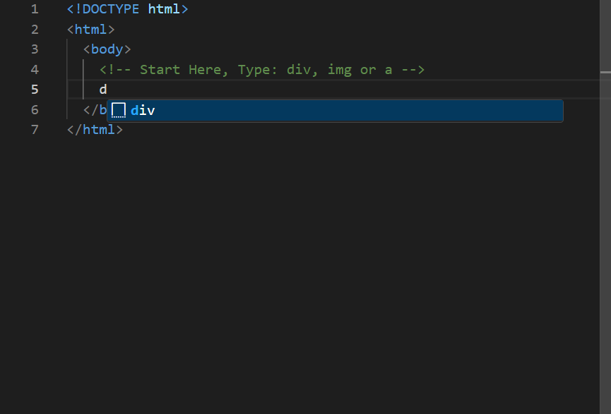

# monaco editor html custom auto complete

This example demonstrates a custom autocomplete feature in HTML.

[⚡️ Play on Stackblitz](https://stackblitz.com/~/github.com/relliv/monaco-editor-html-custom-auto-complete)

## 🌟 Preview

